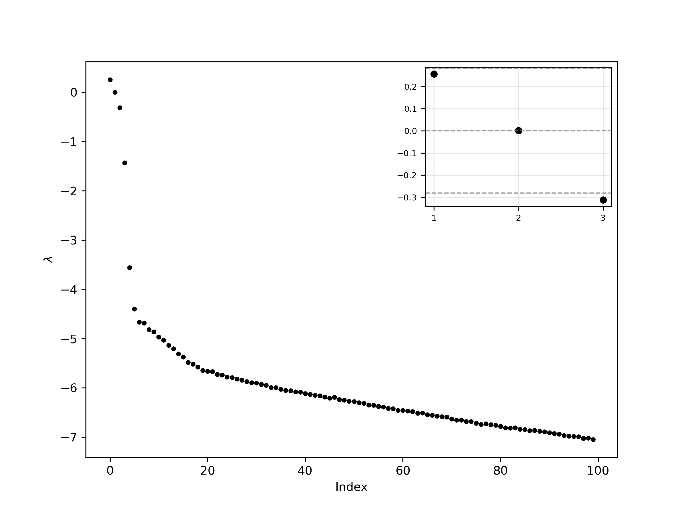

# GRU Lyapunov Spectrum

A recurrent neural network implementation for learning chaotic dynamical systems and computing their Lyapunov spectra. This project demonstrates the application of deep learning to the analysis of nonlinear dynamics using a double pendulum as a test case.

## Overview

This repository provides tools for:
1. Training a custom Gated Recurrent Unit (GRU) network on chaotic time series data
2. Using the trained network as a surrogate dynamical system
3. Computing the full Lyapunov spectrum via Jacobian-based methods
4. Analyzing the stability and chaotic properties of the learned dynamics

## Lyapunov Exponents: Definition

The Lyapunov exponent quantifies the rate of separation of infinitesimally close trajectories in a dynamical system. For a dynamical system with state **x**(t), consider two nearby trajectories separated by an initial perturbation **δx**(0). The perturbation evolves as:

$$|\delta \mathbf{x}(t)| \approx |\delta \mathbf{x}(0)| e^{\lambda t}$$

The Lyapunov exponent λ is defined as:

$$\lambda = \lim_{t \to \infty} \lim_{|\delta \mathbf{x}(0)| \to 0} \frac{1}{t} \ln \frac{|\delta \mathbf{x}(t)|}{|\delta \mathbf{x}(0)|}$$

For an n-dimensional system, there exist n Lyapunov exponents (the **Lyapunov spectrum**), corresponding to the growth rates along different directions in phase space:

- **λ > 0**: Exponential divergence (sensitive dependence on initial conditions, chaos)
- **λ = 0**: Neutral stability (typically associated with the flow direction)
- **λ < 0**: Exponential convergence (dissipation)

A system is considered chaotic if at least one Lyapunov exponent is positive.

## Methodology

### State Representation

The double pendulum state is parameterized as **s** = [sin(θ₁), cos(θ₁), sin(θ₂), cos(θ₂), ω₁, ω₂]ᵀ, where θᵢ and ωᵢ represent the angles and angular velocities of the two pendulum masses. This representation avoids discontinuities inherent in angular coordinates at the 2π boundary, improving training stability.

### Network Architecture

The implementation uses a custom GRU cell with the following update equations:

$$\mathbf{z}_t = \sigma(\mathbf{W}_z [\mathbf{x}_t, \mathbf{h}_{t-1}] + \mathbf{b}_z)$$

$$\mathbf{r}_t = \sigma(\mathbf{W}_r [\mathbf{x}_t, \mathbf{h}_{t-1}] + \mathbf{b}_r)$$

$$\hat{\mathbf{h}}_t = \tanh(\mathbf{W}_h [\mathbf{r}_t \odot \mathbf{h}_{t-1}, \mathbf{x}_t] + \mathbf{b}_h)$$

$$\mathbf{h}_t = (1 - \mathbf{z}_t) \odot \mathbf{h}_{t-1} + \mathbf{z}_t \odot \hat{\mathbf{h}}_t$$

The hidden state **h**_t ∈ ℝ⁶⁰⁰ is mapped to output space via a feedforward network with ReLU activation.

### Lyapunov Spectrum Computation

The algorithm follows the continuous QR decomposition method:

1. **Initialization**: Warm up the hidden state **h** using a trajectory segment from the training data
2. **Perturbation Setup**: Initialize M orthonormal perturbation vectors via QR decomposition of a random matrix
3. **Iteration**: For each time step:
   - Compute the Jacobian **J** = ∂**f**(**h**)/∂**h** using automatic differentiation (`torch.func.jacfwd`)
   - Propagate perturbations: **δh**' = **J** · **δh**
   - At regular intervals (every `norm_freq` steps), perform QR decomposition: **δh** = **QR**
   - Accumulate log growth rates: Σ ln|R_ii|
   - Advance the system: **h** ← **f**(**h**)
4. **Normalization**: Compute Lyapunov exponents as λᵢ = (Σ ln|R_ii|) / (total_time)

This approach treats the trained GRU as an autonomous discrete-time dynamical system and analyzes its stability properties in the learned hidden state space.

### Normalization Constraint

During training and autonomous prediction, the output is projected onto the constraint manifold:

$$
\sin(\theta_i) \leftarrow \frac{\sin(\theta_i)}{\sqrt{\sin^2(\theta_i) + \cos^2(\theta_i)}}
$$

$$
\cos(\theta_i) \leftarrow \frac{\cos(\theta_i)}{\sqrt{\sin^2(\theta_i) + \cos^2(\theta_i)}}
$$

This ensures that the learned dynamics respect the geometric structure of the angular state space.

